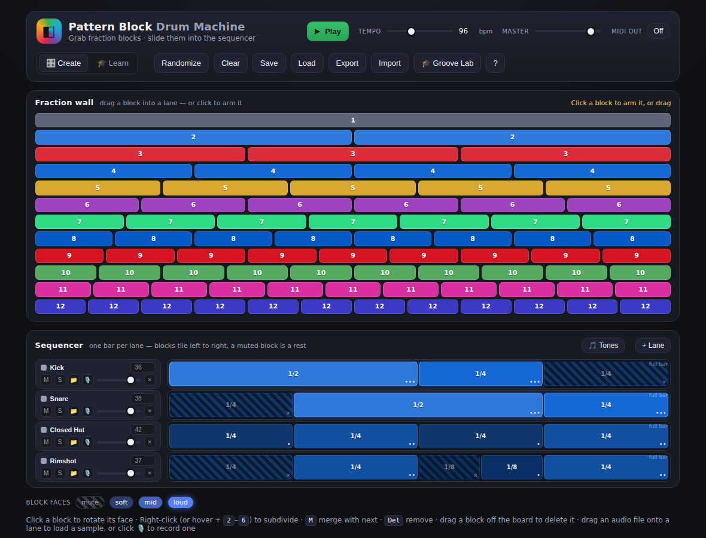
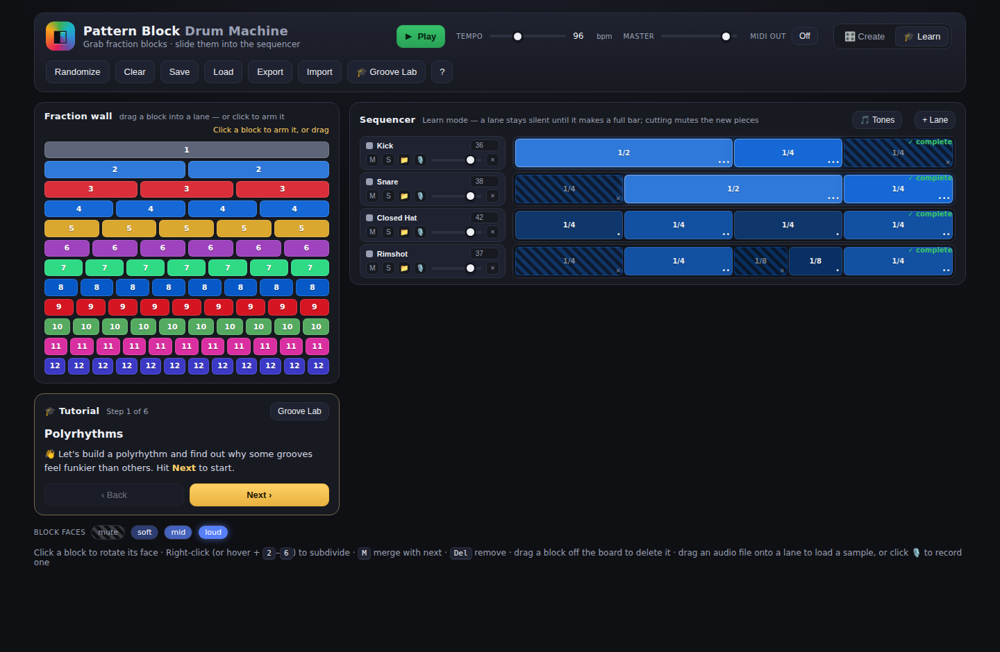

# Pattern Block Drum Machine

A digital take on a **pattern-block drum machine**: the rainbow **fraction wall**
is a bin of wooden blocks, and you slide those fraction-length blocks into a
normal horizontal lane sequencer to build rhythms.

Inspired by classroom fraction rods — every block is a slice of one bar
(`1`, `1/2`, `1/3` … `1/12`), and because a block's **width is its length in
time**, stacking lanes of different fractions gives you rich polyrhythms.

Colours are built from **prime factorization**, not a fixed palette: each prime
gets its own strong hue (2 is blue, 3 is red), a prime power intensifies that
hue as the exponent grows (`9 = 3²` is a deeper "super red"), and a composite
blends its factors' hues weighted by exponent (`6 = 2×3` is purple; `12 = 2²×3`
leans further toward blue than `6` does, from that extra factor of 2). A
block's colour is always the same on the wall and in a lane.



## Run it

It's a single static page — no build step, no dependencies.

```bash
# just open it
open index.html          # macOS
xdg-open index.html      # Linux

# …or serve it (any static server works)
npx serve .
python3 -m http.server
```

Everything runs locally in the browser with the Web Audio API. Nothing is uploaded.

## How to play

- **Build a rhythm** — drag a block from the fraction wall into a lane, or
  **click a block to "arm" it** and then click a lane to drop a copy (no dragging
  needed). Blocks tile from the left; left-to-right is the order they play. The
  brush always follows **whichever block you clicked last** — wall or placed —
  so you can pick up a shape straight from the sequencer. Press <kbd>Esc</kbd> to
  put the brush down. An unfinished lane shows a faint dashed ghost over its
  remaining time (e.g. "3/4 left") so you can see what's left to fill. Drag a
  placed block off the board — onto the wall, the header, anywhere that isn't
  a lane — and it's deleted.
- **Rotate the faces** — click a placed block to turn it to its next face:
  **loud → mid → soft → mute**. That's the block's dynamic, like rotating a
  physical wooden block to a different face. A **muted** block still holds its
  time, so it doubles as a **rest**.
- **Subdivide a beat** — right-click a block (or hover it and press
  <kbd>2</kbd>–<kbd>6</kbd>) to cut it into equal pieces. Split a `1/5` into 3
  and you get three `1/15` pieces — the total length never changes, and the
  pieces stay in perfect alignment with the rest of the bar no matter how deep
  you subdivide. Any new size that isn't on the wall yet (like `1/15`) is
  **added as a new row and the wall reflows to fit**. Press <kbd>M</kbd> to merge
  a block back into the one after it.
- **Bring your own sounds** — each lane has its own sampler. Drag an audio file
  onto a lane, or click 📁 to load one. Click a lane's name to cycle through the
  12 built-in synth voices instead.
- **Or record one** — click 🎙️ on a lane to record straight from your
  microphone (up to 12s), with a live level meter while you record. After you
  stop, drag the two handles on the waveform to trim it, hit **Preview trim** to
  check it, then **Use this sample** to drop the trimmed clip into that lane.
  Nothing is uploaded — recording, trimming and playback all stay in the browser.
- **Send MIDI** — flip **MIDI out** to On and choose a device. Each lane sends
  its own note on channel 10 (the little number by the lane name; defaults follow
  the General-MIDI drum map) and the block face sets the velocity. Great for
  driving hardware or a DAW instrument. *(Web MIDI needs an `https://` page — it
  works on the deployed site, and in Chrome/Edge.)*
- **Mix** — `M` mutes a lane, `S` solos it, and the slider sets its level. Use
  **+ Lane** to add more instruments.
- **Transport** — Space (or the Play button) starts/stops. Tempo sets the bar
  length; one bar = four beats. Stopping cuts any sound still ringing, so long
  samples don't keep playing after you hit Stop.

## 🎵 Tones

Flip **Tones** on (in the sequencer header) to play your beat as pitched notes
instead of drums. Lanes are stacked on a minor-pentatonic scale, so hits that
land together turn into chords — a quick way to hear the *harmony* hiding in a
rhythm.

## 🎓 Learn mode



Switch modes in the header. **Create** is the free-play sampler above, with no
rules. **Learn** turns the app into a guided **tutorial**:

- It walks you step by step through building a **2-against-3 polyrhythm**, then
  sets the puzzle — *cut the pieces until both lanes are made of the same size* —
  so you discover, by ear and eye, that they meet at **sixths** (the LCM of 2
  and 3). It doesn't tell you the missing gaps; you find them.
- In Learn mode a lane stays **silent until it makes a full bar** (a muted block
  counts as a rest), and **cutting a block mutes the new pieces** — so your
  groove stays exactly where it was while the finer grid is revealed underneath.

The **Groove Lab** is a popout (button in the toolbar, works in either mode).
Pick any two numbers, or hit **Use my lanes**, and it live-computes:

- their **HCF (GCD)** and **LCD (LCM)**, with a colour-coded prime factorization
  (the same colours as the wall);
- a **funk level**, from 😌 *Locked* (one is a multiple of the other — no
  polyrhythm) up to 🤯 *Deep funk*. Fewer shared factors ⇒ more slices to line
  them up ⇒ funkier: 2-against-3 needs sixths, 3-against-5 needs fifteenths;
- a plain-English explanation worked out from the shared factor;
- **▶ Hear the polyrhythm** (the two numbers as a click pattern) and **🎵 Hear it
  as a pitch** (the same ratio as two sustained tones). It names the interval in
  **7-limit just intonation and beyond** — so septimal ratios like `7/6` come
  back as a *subminor third*, not "custom", the way Ben Johnston would want.

### Keyboard shortcuts (while hovering a block)

| Key | Action |
| --- | --- |
| <kbd>2</kbd>–<kbd>6</kbd> | Subdivide into that many pieces |
| <kbd>M</kbd> | Merge with the next block |
| <kbd>Del</kbd> / <kbd>Backspace</kbd> | Remove the block |
| <kbd>Esc</kbd> | Put down the armed brush |
| <kbd>Space</kbd> | Play / stop |

## Save & share

- **Save / Load** keep your last pattern in this browser (localStorage).
- **Export** downloads the pattern as JSON; **Import** loads one back. Custom
  audio samples aren't stored in the JSON — reload those per session.

## Under the hood

- `index.html` — layout and controls.
- `styles.css` — the dark board + rainbow fraction-wall styling.
- `app.js` — everything else:
  - **Fraction math** — blocks are stored as exact `n/d` rationals and reduced
    for display, so subdivision/merge is always precise.
  - **Voices** — 12 drum sounds synthesized once into `AudioBuffer`s via an
    `OfflineAudioContext`, so it makes sound with no external assets.
  - **Scheduler** — a look-ahead scheduler (25 ms tick, ~120 ms window) turns
    each lane's tiled blocks into precisely-timed one-shots, with a lane-independent
    gain chain feeding a master bus.

## Physical version?

The long-term dream is the tactile original: wooden fraction blocks you drop into
slots, each with four faces (mute / soft / mid / loud). This digital version is a
playground for the same idea — and a place to prototype patterns before building
the real thing.
